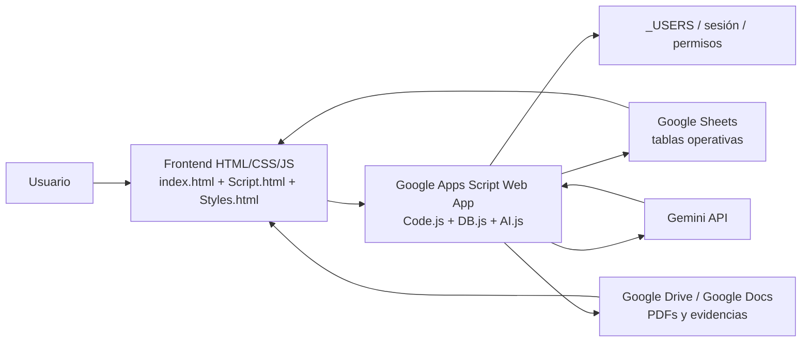
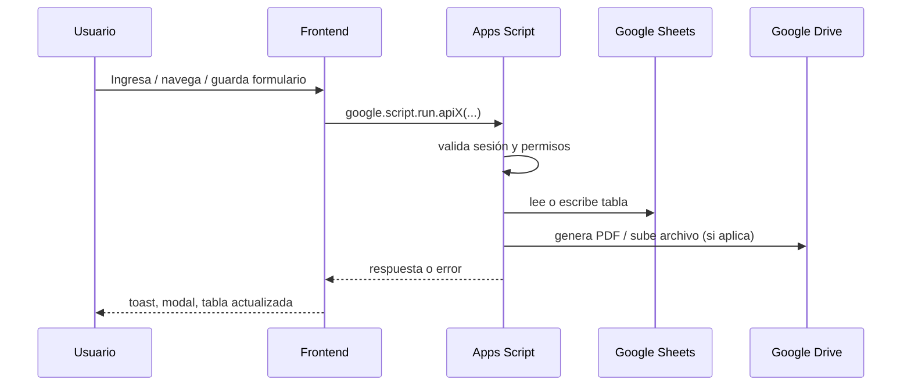

# Arquitectura del Sistema GPMS

## 1. Visión arquitectónica
GPMS implementa una arquitectura web cliente-servidor sobre Google Apps Script. El navegador ejecuta la interfaz HTML/CSS/JavaScript y consume funciones de servidor mediante `google.script.run`. El backend usa Google Sheets como almacenamiento principal y Google Drive/Docs como capa documental.

## 2. Diagrama lógico

## 3. Componentes principales
### 3.1 Frontend
- `index.html`: layout principal, vistas, overlays, carga de estilos/scripts.
- `Login.html`: pantalla de login standalone.
- `Script.html`: estado global, render de módulos, modales, cliente Apps Script.
- `Styles.html`: design system, layout, responsive, componentes visuales.

### 3.2 Backend
- `Code.js`: entry point web, inyección de contexto del usuario, módulos UI.
- `DB.js`: núcleo transaccional, auth, CRUD, sincronizaciones, PDFs, reglas de negocio.
- `AI.js`: integración Gemini, RAG sobre manual/base, asistentes especializados.
- `SetupDB.js`: bootstrap, creación de tablas y migraciones.

### 3.3 Persistencia
- Google Sheets para entidades transaccionales y maestras.
- Google Drive para evidencias y PDFs.
- `CacheService` + `PropertiesService` para sesiones y caché auxiliar.

## 4. Estructura cliente-servidor
### 4.1 Entrada HTTP
`doGet(e)` en `Code.js` construye la aplicación mediante `HtmlService.createTemplateFromFile('index')`.

### 4.2 Inyección de contexto
El backend entrega al frontend:

- `appTitle`
- `forceLogin`
- `currentUserId`
- `currentUserRole`
- `currentUserAssignedVessel`
- `currentUserAssignedVessels`

### 4.3 Comunicación
El frontend llama al backend con dos patrones:

- llamadas directas `google.script.run` para mutaciones;
- `cachedRun(method, args, ttl)` para lecturas cacheables.

## 5. Flujo de datos

## 6. Arquitectura por dominios funcionales
| Dominio | Tablas / servicios principales | Observación |
|---|---|---|
| Seguridad | `_USERS`, sesiones, scopes | Auth local por `USER_ID` + contraseña |
| Flota y activos | `VESSELS`, `ASSETS` | Base maestra técnica |
| Mantenimiento | `MAINTENANCE_PLAN`, `WORK_ORDERS` | Planificación + ejecución |
| Inspecciones | `INSPECTIONS`, `INSPECTIONS_LOG` | Tareas periódicas y registros |
| Fallas | `DEFECT_LOG`, `BARRIER_ASSESSMENTS`, `DEFERRALS` | Gestión de riesgo y degradación operacional |
| Mejora | `RCA_LOG`, `CAPA_LOG` | Investigación y cierre de acciones |
| Repuestos | `SPARES`, `SPARE_ORDERS`, `_STOCK_MOVEMENTS` | Stock y abastecimiento |
| Reportes | `DAILY_REPORTS` | Horas, consumos, resumen ejecutivo |
| Documentos | Drive folders, PDFs, manual | Evidencia controlada |

## 7. Integración con Google Apps Script
### 7.1 Configuración
`appsscript.json` define:

- `runtimeVersion: V8`
- `exceptionLogging: STACKDRIVER`
- `executeAs: USER_DEPLOYING`
- `access: ANYONE`

Scopes declarados:

- `script.external_request`
- `spreadsheets`
- `script.container.ui`
- `userinfo.email`
- `documents`
- `drive`

### 7.2 Implicancias
- La web app es públicamente accesible a nivel URL, pero el acceso real se restringe mediante autenticación propia en `_USERS`.
- El usuario que despliega la web app concentra permisos sobre Drive/Docs/Sheets.

## 8. Seguridad y autenticación
### 8.1 Autenticación
- Login contra tabla `_USERS`.
- Contraseña con hash `sha256$salt$hash`.
- Sesión corta en `CacheService`.
- Token persistente en `ScriptProperties`.

### 8.2 Autorización
- Roles: `ADMIN`, `AUDITOR`, `READ_ONLY`, etc.
- Permisos explícitos por usuario.
- Scopes por activo, embarcación y unidad.
- Filtros de lectura con `filterByAsset(...)`.
- Validación de escritura con `_assertCanWriteTable_(...)`.

## 9. Automatizaciones arquitectónicas relevantes
- Sincronización `WORK_ORDERS -> MAINTENANCE_PLAN`.
- Sincronización `DEFECT_LOG -> ASSETS`.
- Sincronización `DEFERRALS -> DEFECT_LOG / WORK_ORDERS`.
- Actualización de `MAINTENANCE_PLAN.OT_ID` a partir de OTs abiertas.
- Reconciliación de horas reales desde `DAILY_REPORTS`.
- Generación de PDF institucional por evento.

## 10. Deuda técnica estructural
- Backend monolítico en `DB.js`.
- Frontend monolítico en `Script.html`.
- Acoplamiento alto a nombres de columnas en Sheets.
- Dependencia de IDs hardcodeados para entorno productivo.
- Mezcla de estado canónico (`Status`) y estado visible (`Estado_Visible`).

## 11. Recomendaciones arquitectónicas para Antigravity
### 11.1 Separación de capas sugerida
- `Identity & Access`
- `Fleet & Asset Registry`
- `Maintenance Planning`
- `Work Execution`
- `Defect & Risk Management`
- `Document Management`
- `Reporting & Analytics`
- `AI Orchestration`

### 11.2 Principios de migración
- Mantener `TaskID`, `OT_ID`, `Defecto_ID`, `Deferral_ID`, `PI_ID` como llaves funcionales.
- Separar datos canónicos de estados derivados.
- Reemplazar side-effects dispersos por workflows explícitos.
- Modelar los documentos como entidades de primer nivel, no solo URLs.
