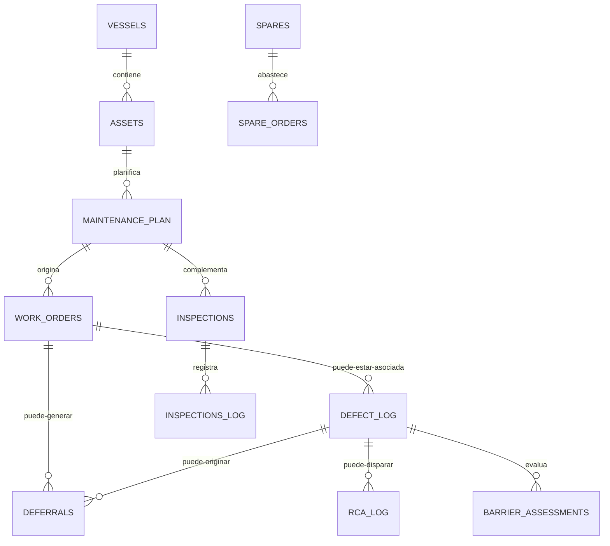

# Estructura de Datos del GPMS

## 1. Modelo de persistencia
La base de datos del sistema está implementada sobre Google Sheets. Cada hoja representa una entidad o agregado funcional. El archivo de referencia observado es `Database/MERCURIO_PMS_DB_CORE.gsheet`, aunque en producción la resolución del spreadsheet se hace por `DB_CONFIG.IDS` en `DB.js`.

## 2. Principios del modelo de datos
- Esquema orientado a tablas planas.
- Claves funcionales explícitas (`TaskID`, `OT_ID`, `Defecto_ID`, etc.).
- Relaciones lógicas por IDs y referencias cruzadas, no por foreign keys formales.
- Sincronizaciones entre tablas como parte de la lógica Apps Script.
- Uso mixto de campos canónicos (`Status`) y visibles (`Estado_Visible`).

## 3. Tablas principales
### 3.1 Seguridad y control
| Tabla | Propósito | Campos clave |
|---|---|---|
| `_USERS` | Directorio de usuarios y permisos | `USER_ID`, `PASSWORD_HASH`, `ROLE`, `PERMISSIONS`, `STATUS`, scopes asignados |
| `_AUDIT_LOG` | Auditoría de acciones | `Timestamp`, `User`, `Action`, `Table`, `RecordID`, `Details` |

### 3.2 Maestro técnico
| Tabla | Propósito | Campos clave |
|---|---|---|
| `VESSELS` | Registro de embarcaciones | `VesselName`, `Codigo_Embarcacion`, `Status`, SFIs de máquinas base |
| `ASSETS` | Inventario técnico por SFI | `SFI`, `Equipo_ID`, `Nombre_Funcional`, `VesselName`, `Criticidad`, `Status` |

### 3.3 Mantenimiento y ejecución
| Tabla | Propósito | Campos clave |
|---|---|---|
| `MAINTENANCE_PLAN` | Plan maestro | `TaskID`, `SFI`, `Frecuencia_HS`, `Frecuencia_Meses`, `Ultima_Ejecucion_*`, `Siguiente_Vencimiento_*`, `Status`, `OT_ID` |
| `WORK_ORDERS` | OT operativa | `OT_ID`, `TaskID`, `AssetID`, `Type`, `Priority`, `Status`, `Estado_Visible`, campos de cierre y diferimiento |

### 3.4 Inspecciones
| Tabla | Propósito | Campos clave |
|---|---|---|
| `INSPECTIONS` | Plan de inspecciones periódicas | `TaskID`, `SFI`, `Frecuencia`, `FREQS`, `FREQM`, `Ultima_Fecha`, `Siguiente_Fecha`, `Estado_Visible` |
| `INSPECTIONS_LOG` | Registro de ejecución | `PI_ID`, `TaskID`, `Fecha_Ejecucion`, `Resultado`, `OT_Asociada`, `VesselName` |

### 3.5 Fallas, riesgo y mejora
| Tabla | Propósito | Campos clave |
|---|---|---|
| `DEFECT_LOG` | Registro de fallas | `Defecto_ID`, `SFI`, `Clasificacion_Falla`, `Estado_Operativo`, `OT_Asociada`, `TaskID`, `Status`, `RCA_ID`, `Link_PDF` |
| `BARRIER_ASSESSMENTS` | Evaluación de barreras | `Defecto_ID`, `operational_decision`, `deferral_impact`, medidas y acciones |
| `DEFERRALS` | Diferimientos | `Deferral_ID`, `Defecto_ID`, `TaskID_Origen`, `OT_Asociada`, `Fecha_Vencimiento`, `Status`, `Estado_Visible` |
| `RCA_LOG` | Análisis causa raíz | `RCA_ID`, `Descripcion_Evento`, `Causa_Raiz`, `Barreras_Falladas`, `Status` |
| `CAPA_LOG` | Acciones correctivas/preventivas | `CAPA_ID`, `Origen_ID`, `Descripcion_Accion`, `Fecha_Compromiso`, `Status` |

### 3.6 Repuestos y compras
| Tabla | Propósito | Campos clave |
|---|---|---|
| `SPARES` | Repuestos críticos | `SKU`, `SFI`, `Stock_Actual`, `MIN`, `SS`, `ROP`, `Status` |
| `SPARE_ORDERS` | Pedido de repuestos | `OrderID`, `SKU`, `Cantidad`, `Proveedor`, `Fecha_Estimada`, `Estado` |
| `_STOCK_MOVEMENTS` | Trazabilidad de stock | `Timestamp`, `SKU`, `Type`, `Quantity`, `Balance`, `Reference` |

### 3.7 Reportes y cumplimiento
| Tabla | Propósito | Campos clave |
|---|---|---|
| `DAILY_REPORTS` | Reporte diario expandido | `ReportID`, `Date`, `Time`, `VesselName`, horas MP/MG, consumos, JSON IA, `Report_PDF_Link` |
| `CERTIFICATES` | Certificados | `Cert_ID`, `VesselName`, `Fecha_Vencimiento`, `Estado_Visible`, `Link_PDF` |
| `PROVEEDORES` | Proveedores aprobados | `ID_Proveedor`, `Razon_Social`, `Categoria`, `Status` |
| `EVAL_PROVEEDORES` | Evaluación post job | `ID_Evaluacion`, `ID_Proveedor`, scores, comentarios |
| `NC_PROVEEDORES` | NC de proveedor | `ID_NC_Proveedor`, `ID_Proveedor`, `Status`, `Evidencia` |

## 4. Relaciones lógicas entre entidades


## 5. Llaves funcionales y convenciones
| Entidad | ID principal | Convención observada |
|---|---|---|
| Tarea mantenimiento | `TaskID` | `SFI-Txx` o `SFI-PIxx` según dominio |
| OT | `OT_ID` | `OT-00001` |
| Defecto | `Defecto_ID` | `DEF-...` |
| Diferimiento | `Deferral_ID` | `DEFR-...` o correlativo funcional |
| Inspección log | `PI_ID` | `PI-...` |
| Pedido repuesto | `OrderID` | `ORD-...` |
| RCA | `RCA_ID` | `RCA-...` |
| CAPA | `CAPA_ID` | `CAPA-...` |

## 6. Campos de estado
### 6.1 Estados canónicos
El backend normaliza muchos `Status` a inglés canónico, por ejemplo:

- `OPEN`
- `PLANNED`
- `IN_PROGRESS`
- `DEFERRED`
- `CLOSED`
- `CANCELLED`

### 6.2 Estados visibles
Para varios módulos existen columnas `Estado_Visible` en español, usadas por la UI:

- `WORK_ORDERS`
- `INSPECTIONS`
- `CERTIFICATES`
- `DEFERRALS`

En `MAINTENANCE_PLAN` el campo principal sigue siendo `Status`, con tensión actual entre uso manual y recalculado.

## 7. Descripción resumida de campos clave
### 7.1 `MAINTENANCE_PLAN`
| Campo | Descripción |
|---|---|
| `TaskID` | Identificador único de tarea del plan |
| `VesselName` | Embarcación asociada |
| `SFI` | Código técnico / sistema |
| `Frecuencia_HS` | Frecuencia en horas |
| `Frecuencia_Meses` | Frecuencia en meses |
| `Ultima_Ejecucion_Fecha` | Última ejecución por calendario |
| `Ultima_Ejecucion_HS` | Última ejecución por horas |
| `Siguiente_Vencimiento_Fecha` | Próximo vencimiento por calendario |
| `Siguiente_Vencimiento_HS` | Próximo vencimiento por horas |
| `Status` | Estado actual del plan |
| `OT_ID` | OT abierta vinculada al task |

### 7.2 `WORK_ORDERS`
| Campo | Descripción |
|---|---|
| `OT_ID` | Identificador de OT |
| `TaskID` | Task de origen del plan o inspección |
| `AssetID` | Referencia al activo/SFI |
| `Type` | Preventiva, Correctiva, Prueba, Condición |
| `Priority` | Baja, Media, Alta, Emergencia |
| `Status` | Estado canónico |
| `Estado_Visible` | Estado de presentación |
| `CompletedDate` | Fecha de cierre efectivo |
| `CompletedHours` | Horas al cierre |
| `Resultado_Prueba` | PASS / FAIL |
| `Evidencia_Files` | Evidencia técnica |

## 8. Modelos definidos en `models.json`
El archivo `models.json` funciona como catálogo de modelos Gemini soportados por el proyecto. Aporta metadata como:

- nombre del modelo;
- métodos soportados;
- límites de tokens y capacidades.

Los modelos observados en el análisis incluyen:

- `gemini-2.5-flash`
- `gemini-2.5-pro`
- `gemini-2.0-flash`

En runtime, `AI.js` usa por defecto `gemini-2.5-flash`, configurable vía `Script Properties` con `GEMINI_MODEL`.

## 9. Ejemplos JSON representativos
### 9.1 Tarea de mantenimiento
```json
{
  "TaskID": "N/A-T01",
  "VesselName": "GLT 001",
  "SFI": "810.03",
  "Equipo": "Bomba de carga",
  "Tarea_Mantenimiento": "Inspección visual y funcional",
  "Frecuencia_HS": "0",
  "Frecuencia_Meses": "12",
  "Ultima_Ejecucion_Fecha": "04-09-2026",
  "Siguiente_Vencimiento_Fecha": "04-09-2027",
  "Status": "VALIDO",
  "OT_ID": "OT-00010",
  "Criticidad": "B"
}
```

### 9.2 Orden de trabajo
```json
{
  "OT_ID": "OT-00010",
  "TaskID": "N/A-T01",
  "VesselName": "GLT 001",
  "AssetID": "810.03",
  "Type": "Preventiva",
  "Priority": "Alta",
  "Status": "PLANNED",
  "Estado_Visible": "PLANIFICADA",
  "OpenDate": "2026-04-10",
  "PlannedDate": "2026-04-15",
  "Resultado_Prueba": "",
  "Evidencia_Files": ""
}
```

### 9.3 Defecto con barreras y OT asociada
```json
{
  "Defecto_ID": "DEF-GL01-2026-001",
  "Fecha_Reporte": "10-04-2026",
  "Embarcacion": "GLT 001",
  "SFI": "810.03 - Bomba de carga",
  "Clasificacion_Falla": "B",
  "Descripcion_Sintoma": "Pérdida de rendimiento y vibración anormal.",
  "Estado_Operativo": "FALLA",
  "OT_Asociada": "OT-00009",
  "TaskID": "N/A-T01",
  "Status": "OPEN",
  "RCA_ID": ""
}
```

## 10. Trazabilidad y control documental
La trazabilidad no se resuelve solo con tablas: también depende de los documentos generados y almacenados en Drive.

Elementos trazables:

- vínculo entre `TaskID` y `OT_ID`;
- vínculo entre `OT_ID` y `Defecto_ID`;
- vínculo entre `Defecto_ID`, barreras, diferimientos y RCA;
- PDFs en `Check Lists/OT`, `Check Lists/DEFECTOS`, `Check Lists/DAILY_REPORTS`;
- auditoría en `_AUDIT_LOG`;
- movimientos de stock en `_STOCK_MOVEMENTS`.

## 11. Riesgos del modelo actual
- Fuerte dependencia de nombres de columnas como contrato implícito.
- Relación entre entidades resuelta por strings e IDs funcionales.
- Persistencia en Sheets con side-effects transversales.
- Falta de constraints estructurales formales.
- Riesgo de inconsistencias cuando el mismo estado se calcula y además se edita manualmente.
