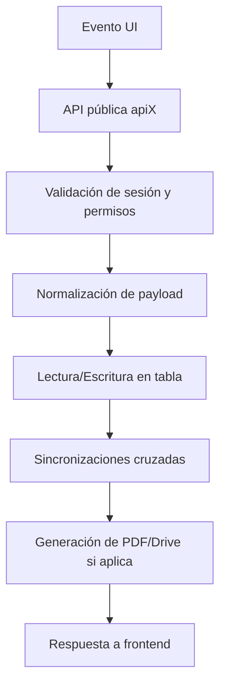

# Lógica Backend del GPMS

## 1. Panorama general
El backend está implementado casi íntegramente en Google Apps Script y reparte responsabilidades entre cuatro archivos principales:

- `Code.js`
- `DB.js`
- `AI.js`
- `SetupDB.js`

La mayor parte de la lógica de negocio vive en `DB.js`, que actúa simultáneamente como capa de acceso a datos, dominio, seguridad y orquestación de side-effects.

## 2. `Code.js`
### 2.1 Responsabilidad
Es la puerta de entrada HTTP de la web app.

### 2.2 Funciones clave
| Función | Propósito |
|---|---|
| `doGet(e)` | Renderiza `index.html`, detecta usuario autenticado e inyecta contexto al cliente |
| `include(filename)` | Inserta archivos HTML auxiliares (`Styles`, `Script`) |
| `getModulesConfig()` | Devuelve catálogo de módulos para el dashboard |
| `getOAuthToken()` | Entrega token OAuth para Google Picker |

### 2.3 Lógica relevante
- Fuerza una operación simple sobre Drive para disparar permisos.
- Define título de app: `Mercurio PMS`.
- Pasa al frontend atributos del usuario activo.

## 3. `DB.js`
## 3.1 Rol del archivo
Es el núcleo operativo del sistema. Su alcance incluye:

- configuración global (`DB_CONFIG`);
- autenticación y sesiones;
- permisos y scopes;
- acceso a Google Sheets;
- CRUD genérico;
- reglas específicas por módulo;
- sincronización entre tablas;
- generación de PDFs;
- uploads a Drive;
- auditoría y stock movements.

## 3.2 Configuración y constantes
Incluye:

- IDs de spreadsheets por dominio.
- IDs de carpetas Drive.
- nombres de tablas.
- headers canónicos por tabla.

Patrón crítico: los headers definidos en `DB_CONFIG.HEADERS` son el contrato estructural de la aplicación.

## 3.3 Autenticación y sesiones
### Funciones relevantes
- `getAuthenticatedUser()`
- `apiLogin(userId, password)`
- `apiResumeSession(sessionToken)`
- `apiLogout(sessionToken)`
- `setUserPassword(userId, plainPassword)`
- `bootstrapUsersDirectory()`

### Flujo resumido
```text
apiLogin
  -> busca USER_ID en _USERS
  -> valida STATUS=ACTIVE
  -> verifica PASSWORD_HASH
  -> crea sesión corta en CacheService
  -> crea token persistente en ScriptProperties
  -> devuelve token y contexto
```

### Mecanismo de seguridad
- hash `sha256$salt$hash`.
- sesión persistente rehidratable.
- control por rol, permiso y scope.

## 3.4 Control de acceso
### Funciones clave
- `_requireAuthenticatedUser_()`
- `_assertCanWriteTable_(user, tableName)`
- `assertAssetAccess(user, recordOrAssetId)`
- `filterByAsset(user, rows)`
- `_forcePayloadScopeToUser_(payload, headers, user)`

### Modelo
El acceso se filtra por:

- activo (`ASSET_ID`, `SFI`);
- embarcación (`VesselName`, `Embarcacion`);
- unidad (`UNIT_ID`).

Los perfiles `AUDITOR`/`READ_ONLY` quedan limitados a lectura.

## 3.5 Capa de datos genérica
### Funciones clave
| Función | Propósito |
|---|---|
| `readTable(tableName)` | Lectura y mapeo de hoja a objetos |
| `createRecord(tableName, payload)` | Alta simple |
| `createRecordsBatch(tableName, payloads)` | Alta por lote |
| `updateRecord(tableName, rowIndex, payload)` | Actualización por `_rowIndex` |
| `deleteRecordsBatch(tableName, fieldName, value)` | Borrado filtrado |
| `ensureHeaders(sheet, tableName)` | Garantiza estructura mínima |
| `getOrCreateSheet(ss, tableName)` | Resuelve hoja y fallback por headers |

### Particularidades
- El backend normaliza y completa columnas faltantes automáticamente.
- Se trabaja sobre nombres de columnas como contrato flexible.
- Muchas actualizaciones se hacen fila completa o por columna puntual.

## 3.6 Lógica funcional por dominio
### 3.6.1 Flota e inventario
- `apiGetVessels`, `apiCreateVessel`, `apiUpdateVessel`
- `apiGetInventory`, `apiCreateInventory`, `apiUpdateInventory`

Lógica importante:
- conciliación de estado del inventario a partir de defectos abiertos;
- normalización de SFI para matching robusto;
- manejo de equipos Ex.

### 3.6.2 Plan de mantenimiento
- `apiGetMaintenancePlan`
- `apiCreateMaintenancePlan`
- `apiUpdateMaintenancePlan`
- `apiSyncMaintenanceIDs`
- `apiSyncMaintenancePlanStatuses`
- `apiSyncMaintenancePlanOtIds`

Funciones internas relevantes:
- `_resolveMaintenancePlanStatus_()`
- `_syncMaintenancePlanStatuses_()`
- `_syncMaintenancePlanOpenOtIds_()`
- `_getAffectedMaintenanceTaskIdsForWorkOrder_()`

### 3.6.3 Órdenes de trabajo
- `apiGetWorkOrders`
- `apiGetWorkOrdersPlanIndex`
- `apiCreateWorkOrder`
- `apiUpdateWorkOrder`
- `apiSyncWorkOrderVisibleStatuses`

Procesos clave:
- asignación de `OT_ID` correlativo;
- herencia de `TaskID` y criticidad;
- cierre técnico con validaciones `4-eyes`;
- sincronización con plan maestro, defectos, diferimientos y activos.

### 3.6.4 Inspecciones
- `apiGetInspections`
- `apiCreateInspection`
- `apiUpdateInspection`
- `apiGetInspectionsLog`
- `apiCreateInspectionLog`
- `apiFindLatestInspectionLogByTaskId`

Lógica importante:
- autoasignación de `TaskID`;
- cálculo de `FREQS`, `FREQM` y `Siguiente_Fecha`;
- persistencia de `Estado_Visible`.

### 3.6.5 Defectos y barreras
- `apiGetDefects`
- `apiCreateDefect`
- `apiUpdateDefect`
- `apiGetBarrierAssessment`
- `apiSaveBarrierAssessment`

Procesos:
- generación de `Defecto_ID`;
- vinculación a OT y TaskID;
- actualización de estado operativo del activo;
- disparo potencial de RCA.

### 3.6.6 Diferimientos
- `apiGetDeferrals`
- `apiCreateDeferral`
- `apiUpdateDeferral`

Reglas:
- bloqueo por condición `NO-GO`;
- validación por barreras y riesgo;
- sincronización con defecto y OT.

### 3.6.7 RCA / CAPA
- `apiGetRCAs`, `apiCreateRCA`, `apiUpdateRCA`
- `apiGetCAPAs`, `apiCreateCAPA`, `apiUpdateCAPA`

### 3.6.8 Repuestos y pedidos
- `apiGetSpares`, `apiCreateSpare`, `apiUpdateSpare`
- `apiConsumeSpares`
- `apiGetSpareOrders`, `apiCreateSpareOrder`, `apiUpdateSpareOrder`

### 3.6.9 Reporte diario
- `apiGetDailyReports`
- `apiGetDetailedDailyReport`
- `apiSaveDeepDailyReport`
- `apiBuildDailyExecutiveSummary`
- `apiGetDailyHoursIndex`

Impacta:
- horas reales de activos;
- resumen ejecutivo;
- insights IA;
- generación PDF.

## 4. Automatizaciones transversales
### 4.1 Ejemplo: cierre de OT
```pseudocode
si OT pasa a CLOSED:
  validar prueba/evidencia/verificador si es crítica
  actualizar plan maestro con última ejecución y próximo vencimiento
  cerrar o ajustar defectos relacionados
  cerrar o ajustar diferimientos relacionados
  actualizar estado del activo si corresponde
  recalcular Estado_Visible de OT
  recalcular OT_ID/Status del plan maestro
```

### 4.2 Ejemplo: creación de diferimiento
```pseudocode
crear diferimiento
  -> validar que no sea NO-GO
  -> consultar evaluación de barreras
  -> persistir solicitud
  -> actualizar defecto asociado a DEFERRED
  -> actualizar OT asociada si aplica
  -> recalcular Estado_Visible
```

## 5. Generación documental y Drive
### Funciones destacadas
- `apiGenerateWorkOrderOpeningPdf`
- `apiGenerateWorkOrderClosurePdf`
- `apiGenerateWorkOrderDeferralRequestPdf`
- `apiGenerateSpareOrderRequestPdf`
- `apiGenerateSpareOrderReceiptPdf`
- `apiGenerateDefectPdf`
- `apiUploadFile`

### Patrón
- se compone un documento con `DocumentApp`;
- se exporta o copia como PDF a Drive;
- se retorna URL para persistirla en la tabla correspondiente.

## 6. `AI.js`
## 6.1 Rol
Proporciona la capa de inteligencia artificial y recuperación de contexto.

## 6.2 Configuración
- `AI_CONFIG`
- `DATA_SOURCE_CONFIG`
- `AI_EXCLUDED_SHEETS`

IDs hardcodeados observados:
- manual de referencia en Drive;
- spreadsheet principal.

## 6.3 Capacidades IA
| Función | Uso |
|---|---|
| `apiAskAssistant` | Chat general Mercurio |
| `apiAskGeminiRca` | RCA asistido |
| `apiAskGeminiDefect` | diagnóstico inicial de defecto |
| `apiAnalyzeWorkOrderDeferral` | evaluación IA de plazo/riesgo |
| `apiAnalyzeDailyMaintenanceInsights` | insights diarios de mantenimiento |
| `apiBarrierInterviewer` | entrevista guiada de barreras |

## 6.4 Fuentes de contexto
- Manual corporativo.
- Índice de la base de datos.
- Historial de conversación.

Observación crítica: la infraestructura para usar contexto de base existe, pero el asistente general no siempre la inyecta efectivamente en runtime.

## 7. `SetupDB.js`
## 7.1 Propósito
Provisioning inicial del entorno y algunas migraciones.

## 7.2 Funciones principales
| Función | Propósito |
|---|---|
| `initMercurioDatabase()` | crea spreadsheet base y carpeta de evidencias |
| `initProveedoresDatabase()` | crea DB de proveedores |
| `initExistingDatabase()` | refuerza estructura en DB existente |
| `createRcaCapaTables()` | agrega tablas RCA/CAPA |
| `createDefectLogTable()` | crea hoja de defectos |
| `createSpareOrdersTable()` | crea tabla de pedidos |
| `migrateCriticalEquipmentToInventory()` | migración legado |

## 8. Flujo backend de extremo a extremo


## 9. Riesgos del backend actual
- Monolito en `DB.js`.
- Side-effects encadenados difíciles de aislar.
- Acoplamiento fuerte a Google Sheets y nombres de columnas.
- Configuración hardcodeada de IDs.
- Tokens persistentes sin ciclo de vida robusto.

## 10. Recomendaciones de rediseño
- dividir backend por bounded contexts;
- separar repositorios, servicios y workflows;
- externalizar configuración a variables/secretos de entorno;
- crear capa formal de eventos de dominio;
- convertir sincronizaciones implícitas en procesos explícitos y auditables.
