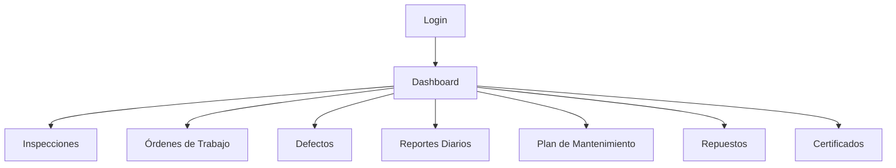
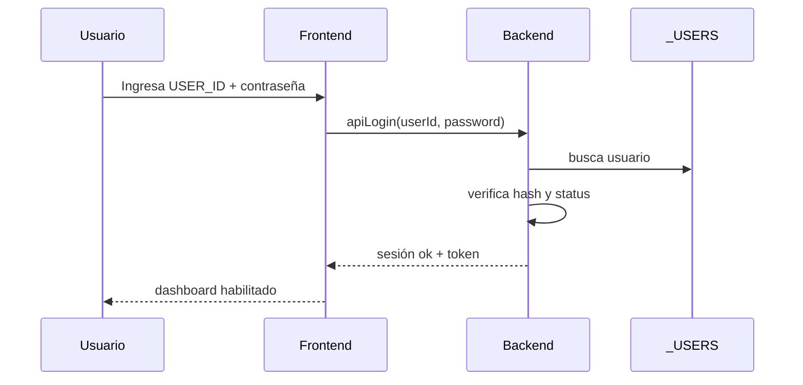
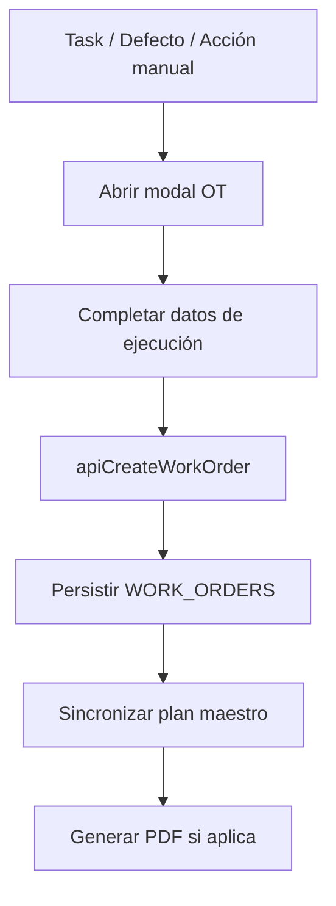
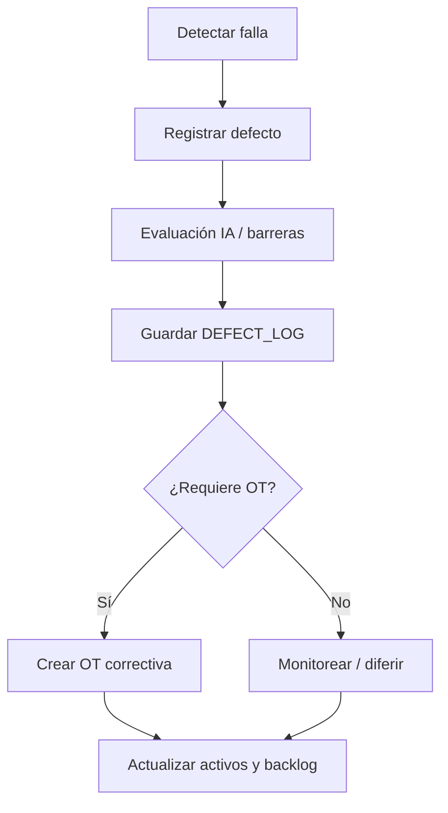

# Flujos Operativos de Usuario

## 1. Objetivo
Este documento resume los principales workflows operativos del GPMS desde la perspectiva de uso.

## 2. Flujo global de navegación

## 3. Inicio de sesión
### Pasos
1. El usuario abre la web app.
2. `doGet()` decide si debe mostrarse el login.
3. El usuario ingresa `USER_ID` y contraseña.
4. El frontend llama `apiLogin(userId, password)`.
5. El backend valida usuario activo y contraseña.
6. Se crea sesión y token persistente.
7. El dashboard se recarga con el contexto del usuario.

### Diagrama

## 4. Registro de inspecciones
### Flujo de definición de tarea
1. El usuario abre `PLAN DE INSPECCIONES`.
2. Crea o edita una tarea en `INSPECTIONS`.
3. Define frecuencia, responsable, criterios y checklist.
4. El sistema calcula `FREQS/FREQM` y próxima revisión.
5. El task queda disponible para ejecución.

### Flujo de ejecución
1. El usuario elige `REGISTRAR RESULTADO`.
2. Carga fecha, resultado, observaciones y evidencia.
3. Se guarda un registro en `INSPECTIONS_LOG`.
4. Si el resultado es falla, puede derivar a OT correctiva.

## 5. Creación de órdenes de trabajo
### Flujo
1. El usuario selecciona una tarea del plan o un evento correctivo.
2. Se abre el modal de OT.
3. El sistema propone `TaskID`, criticidad y datos del activo.
4. El usuario completa prioridad, responsables y fecha.
5. Se genera `OT_ID` y se persiste en `WORK_ORDERS`.
6. El sistema sincroniza `MAINTENANCE_PLAN.OT_ID` y estado del task.

### Diagrama

## 6. Cierre de orden de trabajo
### Flujo
1. El usuario edita una OT abierta.
2. Registra `CompletedDate`, `CompletedHours`, prueba y evidencia.
3. Si la OT es crítica, el sistema exige validaciones adicionales.
4. Al cerrar la OT:
   - actualiza el plan maestro;
   - limpia o ajusta `OT_ID` en `MAINTENANCE_PLAN`;
   - puede cerrar defectos/diferimientos vinculados;
   - actualiza estado del activo.

## 7. Reporte de defectos
### Flujo
1. El usuario abre `REGISTRO DE FALLAS`.
2. Completa embarcación, SFI, criticidad y síntoma.
3. Puede usar el asistente IA de defectos y barreras.
4. El sistema valida restricciones operativas.
5. Se guarda en `DEFECT_LOG`.
6. Opcionalmente genera una OT correctiva.
7. Puede emitirse PDF del defecto.

### Diagrama

## 8. Gestión de mantenimiento planificado
### Flujo
1. El usuario consulta el plan maestro.
2. Filtra por embarcación, grupo SFI o vencimiento.
3. Edita la tarea o crea OT desde el task.
4. El sistema usa la OT y reportes diarios para mantener trazabilidad.
5. Los estados se reflejan en el backlog y dashboard.

## 9. Gestión de diferimientos
### Flujo
1. Desde una OT o defecto, el usuario solicita diferimiento.
2. Se ejecuta evaluación IA de plazo/riesgo si corresponde.
3. El sistema revisa barreras y condición NO-GO.
4. Si pasa validaciones, se crea `DEFERRALS`.
5. Se actualizan OT y defecto asociados.

## 10. Generación de informes
### Tipos de informes observados
- PDF de apertura de OT.
- PDF de cierre de OT.
- PDF de solicitud de diferimiento.
- PDF de pedido/recepción de repuestos.
- PDF de defecto.
- PDF de reporte diario.

### Flujo genérico
1. Usuario guarda el registro técnico.
2. Invoca la acción `GENERAR PDF`.
3. El backend compone el documento en Drive.
4. Devuelve la URL.
5. La URL queda persistida en la entidad correspondiente.

## 11. Reporte diario operativo
### Flujo
1. Usuario abre `REPORTE DIARIO DE OPERACIONES`.
2. Selecciona embarcación y fecha.
3. Carga horas de máquinas, consumos y hallazgos.
4. Guarda reporte profundo.
5. El sistema puede generar resumen ejecutivo e insights IA.
6. Las horas alimentan la lógica del mantenimiento.

## 12. Recomendaciones para reimplementación de workflows
- modelar cada workflow como state machine explícita;
- separar acciones manuales de estados calculados;
- registrar eventos de dominio además del estado final;
- mantener outputs documentales como parte del flujo, no como paso secundario.
