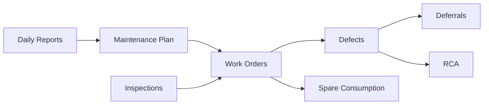

# Integraciones y Tecnologías

## 1. Stack tecnológico
| Tecnología | Uso |
|---|---|
| Google Apps Script | backend, routing, servicios y automatizaciones |
| Google Sheets | persistencia de datos |
| Google Drive | repositorio de evidencias y PDFs |
| Google Docs / DocumentApp | generación de documentos |
| HTML5 | estructura de la UI |
| CSS3 | diseño visual y responsive |
| JavaScript | lógica cliente |
| JSON | intercambio/configuración/modelos |
| Gemini API | inteligencia artificial |
| Leaflet | mapa de recorrido |
| clasp | despliegue Apps Script |

## 2. Google Apps Script
### Rol
Es la plataforma de ejecución principal del backend.

### Capacidades utilizadas
- `HtmlService`
- `SpreadsheetApp`
- `DriveApp`
- `DocumentApp`
- `CacheService`
- `PropertiesService`
- `LockService`
- `ScriptApp`
- `UrlFetchApp`

## 3. Google Sheets
### Rol
Base de datos transaccional y maestra.

### Ventajas actuales
- fácil de operar para equipos no técnicos;
- visible y editable por negocio;
- flexible para agregar columnas.

### Limitaciones
- sin constraints relacionales formales;
- rendimiento y concurrencia limitados;
- mayor fragilidad frente a cambios manuales de estructura.

## 4. Google Drive
### Rol
Repositorio de:

- evidencias;
- PDFs generados;
- documentos controlados;
- checklist y manuales.

### Carpetas observadas
- carpeta de evidencias principal;
- carpeta de checklist;
- carpeta de PDFs de defectos.

## 5. HTML5, CSS3 y JavaScript
### Frontend actual
- SPA vanilla;
- render por `innerHTML`;
- modales dinámicos;
- integración fuerte con backend GAS.

### Ventaja
Simplicidad de despliegue en Apps Script.

### Desventaja
Monolitismo y mantenimiento complejo a gran escala.

## 6. JSON
### Usos observados
- payloads cliente-servidor;
- respuestas de IA;
- snapshots de resumen ejecutivo;
- `models.json` como catálogo de modelos Gemini;
- almacenamiento de insights y estructuras IA dentro de `DAILY_REPORTS`.

## 7. APIs externas
### Gemini API
Consumida desde `AI.js` mediante `UrlFetchApp.fetch()` hacia `generativelanguage.googleapis.com`.

### OpenStreetMap / Leaflet
Utilizada en la vista de recorrido para mostrar mapas y trayectoria.

### Google API JS / Picker
Usada en frontend para selección de archivos Drive.

## 8. Integración con IA
### Casos de uso
- asistente general;
- RCA;
- defectos;
- barreras;
- diferimientos;
- insights del reporte diario.

### Configuración
- `GEMINI_API_KEY` requerido en `Script Properties`.
- `GEMINI_MODEL` opcional.

## 9. Integración entre módulos internos

## 10. Consideraciones técnicas para migración
- externalizar IDs de Google a configuración por ambiente;
- definir adaptadores para Sheets/Drive/AI;
- desacoplar el frontend de `google.script.run` mediante una API intermedia;
- tratar Gemini como servicio orquestado con prompts versionados.
