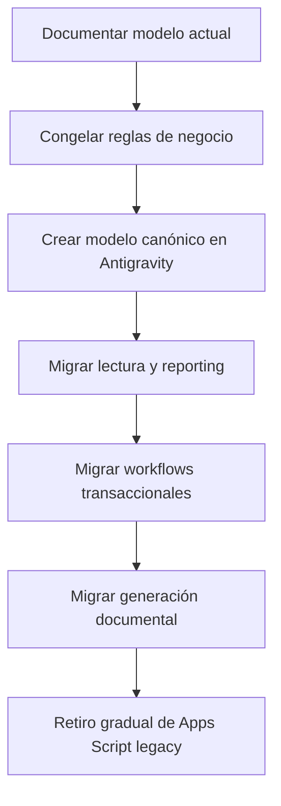

# Mejora Continua y Roadmap

## 1. Objetivo del roadmap
Definir una hoja de ruta para estabilizar, optimizar y reimplementar GPMS sin perder reglas operativas, trazabilidad ni valor documental.

## 2. Diagnóstico resumido
### Fortalezas
- sistema funcional y ya usado con evidencia real;
- muy buena cobertura del proceso de mantenimiento;
- fuerte integración documental;
- IA aplicada a casos de alto valor;
- alta trazabilidad operativa.

### Debilidades
- arquitectura monolítica;
- fuerte acoplamiento a Sheets/Drive/IDs;
- mezcla de estados manuales y calculados;
- riesgo de divergencia entre manual y código;
- dificultad creciente para mantenimiento evolutivo.

## 3. Recomendaciones de optimización inmediata
### Prioridad alta
- separar estados manuales de estados calculados;
- consolidar configuración sensible fuera del código;
- reducir side-effects implícitos entre módulos;
- fortalecer expiración y manejo de sesión;
- eliminar rutas o patrones legacy no usados.

### Prioridad media
- modularizar `DB.js` y `Script.html`;
- unificar manejo de errores y feedback UI;
- normalizar nomenclatura documental y carpetas Drive;
- reforzar trazabilidad de cambios estructurales en hojas.

## 4. Escalabilidad
### Limitantes actuales
- Google Sheets como DB principal;
- Apps Script como backend monolítico;
- render frontend imperativo;
- configuración embebida en código.

### Mejoras sugeridas
- introducir capas de servicio por dominio;
- reemplazar parte de la lógica reactiva por workflows/eventos;
- incorporar almacenamiento más robusto para entidades críticas si el volumen crece.

## 5. Integración con sistemas externos
Futuras integraciones recomendadas:

- ERP / compras;
- sistema de RRHH o directorio corporativo;
- sensores / telemetría / IoT;
- motor documental corporativo;
- BI / data warehouse;
- notificaciones por correo, chat corporativo o workflow approvals.

## 6. Evolución hacia PMS 2.0
### Meta
Pasar de una solución funcional monolítica a una plataforma modular, auditable y extensible.

### Capacidades deseables
- event sourcing o bitácora de negocio;
- motor de workflow;
- modelo documental de primer nivel;
- permisos centralizados;
- API estable;
- componentes UI reutilizables;
- IA con prompts/versionado y observabilidad.

## 7. Roadmap sugerido
### Fase 1: Estabilización
- congelar esquema funcional actual;
- documentar entidades, workflows y reglas;
- corregir conflictos estado manual vs calculado;
- consolidar configuración de ambiente;
- crear suite mínima de regresión manual.

### Fase 2: Modularización
- dividir backend por dominios;
- dividir frontend por módulos;
- formalizar capa de servicios;
- limpiar deuda técnica de navegación y estados globales.

### Fase 3: Gobernanza y observabilidad
- trazabilidad de eventos;
- métricas técnicas y operativas;
- logging estructurado;
- backups y restore testados;
- gobierno documental alineado al manual maestro.

### Fase 4: Reimplementación Antigravity
- modelado de entidades canónicas;
- diseño de workflows explícitos;
- separación UI/API/automation/documentos;
- migración gradual por módulo.

## 8. Recomendaciones específicas para Antigravity
### 8.1 Dominios sugeridos
- Identidad y permisos.
- Flota y activos.
- Mantenimiento planificado.
- Ejecución de OT.
- Defectos y barreras.
- Diferimientos.
- RCA/CAPA.
- Repuestos y abastecimiento.
- Reporte diario e insights.
- Gestión documental.
- Orquestación IA.

### 8.2 Contratos que deben preservarse
- IDs funcionales.
- nomenclatura documental.
- vínculo entre task, OT, defecto y diferimiento.
- criterios de criticidad A/B/C.
- validaciones NO-GO y cierre crítico.
- generación y retención de evidencia.

### 8.3 Estrategia de migración recomendada

## 9. Backlog técnico recomendado
| Prioridad | Iniciativa | Beneficio |
|---|---|---|
| Alta | separar estado calculado/manual | elimina sobrescrituras indeseadas |
| Alta | mover IDs y secretos a config externa | facilita multiambiente |
| Alta | modularizar `DB.js` | reduce riesgo de regresión |
| Media | modularizar `Script.html` | mejora mantenibilidad frontend |
| Media | reforzar sesiones y auth | eleva seguridad |
| Media | normalizar repositorio documental | mejora auditoría |
| Baja | reemplazar UI legacy | mejora UX y consistencia |

## 10. Cierre
GPMS ya resuelve un problema real y complejo. La prioridad no debería ser “reconstruir desde cero” sin control, sino capturar fielmente su lógica operacional, separar lo canónico de lo accidental y usar esa base para una transición segura hacia una plataforma más moderna y mantenible.
